# [点我下载 exe](https://gitee.com/EmeryWan/GradeEntry/attach_files/247640/download)

exe 双击即可运行  

### [点我下载简略说明PDF](https://gitee.com/EmeryWan/GradeEntry/attach_files/247641/download)

# 华东交通大学成绩录入辅助软件

华东交通大学 - 软件学院 - 和平研究院

## 源码运行

```shell
git clone https://gitee.com/EmeryWan/GradeEntry.git
cd GradeEntry
pip install -r requirements.txt
python GreadEntryApplication.py
```

## 了解详情
  
[码云](https://gitee.com/EmeryWan/GradeEntry)

# 使用教程

## 软件包含


双击 exe 文件即可运行

## 初始界面

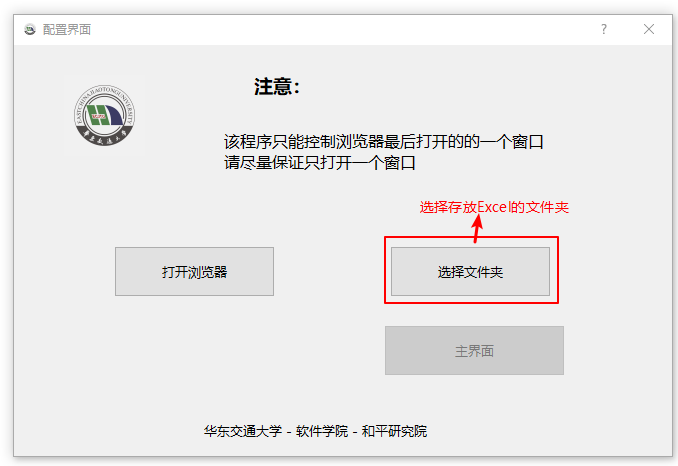

- 点击打开浏览器 会打开一个程序可控制的浏览器窗口
- 点击选择文件夹 程序会读取选择文件夹中的全部 Excel 文件

第一次运行该软件会进入下载驱动界面

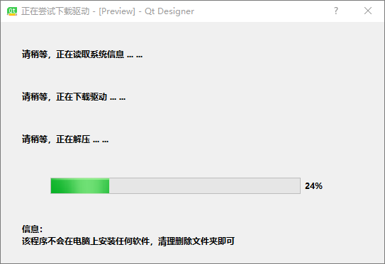

下载完成后再次打开浏览器即可

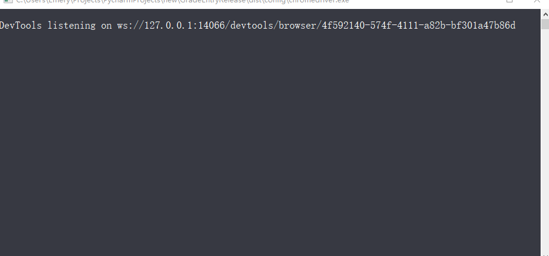

运行过程中因使用浏览器驱动程序，会出现一个终端，使用时请不要关闭该终端

## 主界面

该程序可对 百分制、五级制、两级制 进行录入

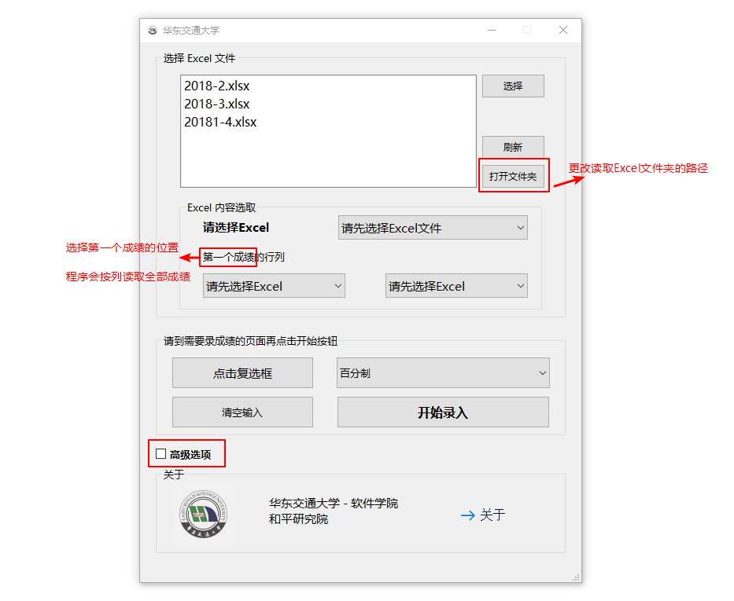

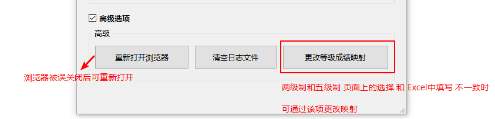

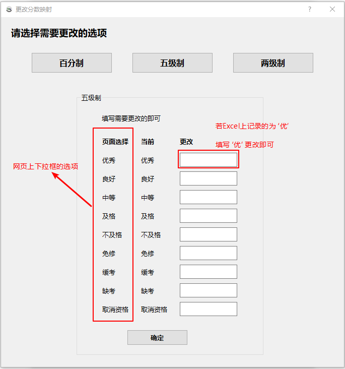

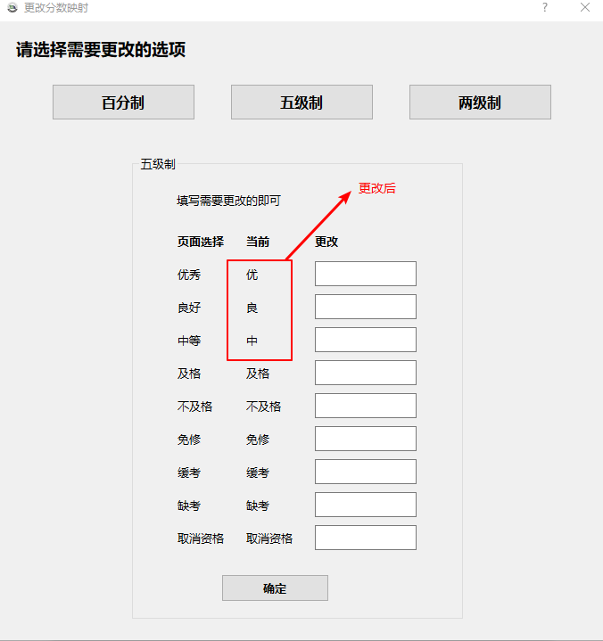

## 开始录入

选择需要的 Excel 文件， 及 Excel页 和 第一个成绩所在的行列位置

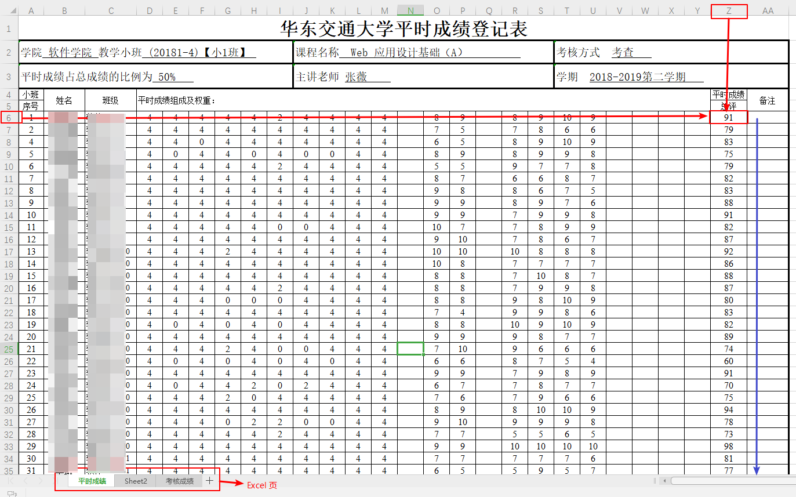

浏览器到达录入成绩的界面后，点击开始即可  
**注意：** 自动填充时会占用鼠标和键盘，在这几秒内请尽量不要使用鼠标和键盘

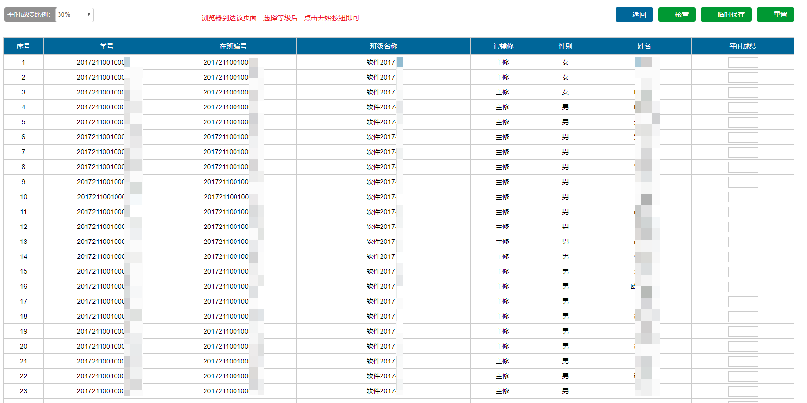

完成后请自行操作

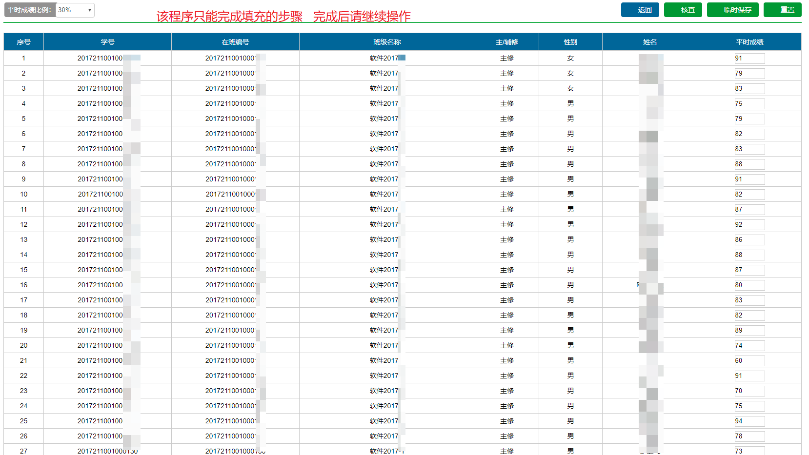

五级制、两级制 同理

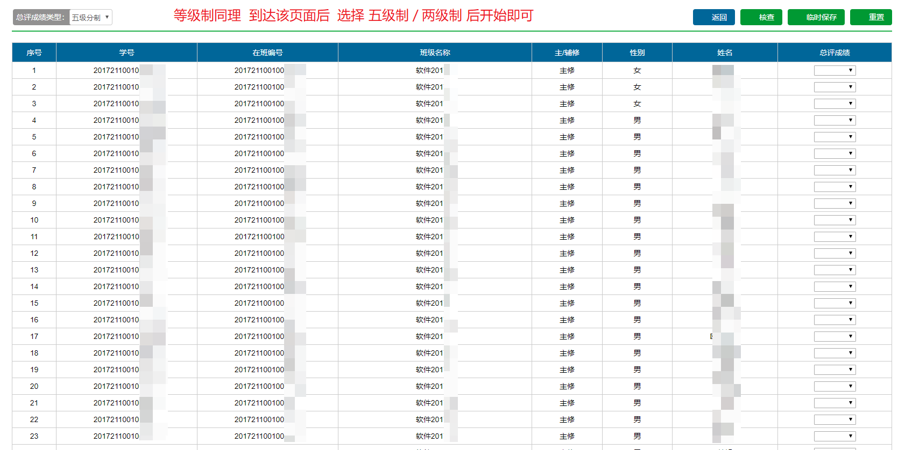
