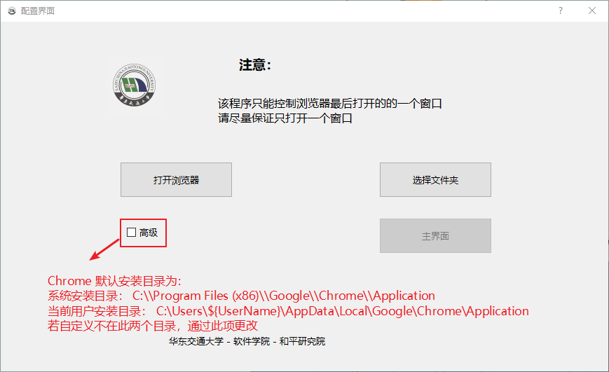
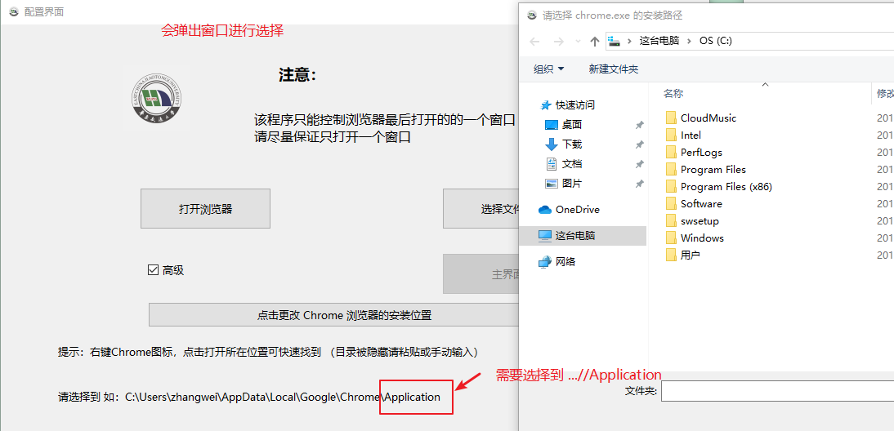

# [点我下载 exe](https://github.com/EmeryWan/GradeEntry/releases)

exe 双击即可运行  

### [点我下载简略说明PDF](https://github.com/EmeryWan/GradeEntry/releases)

# 华东交通大学成绩录入辅助软件

华东交通大学 - 软件学院 - 和平研究院

## 源码运行

pip install 太慢建议修改源镜像

```shell
git clone https://gitee.com/EmeryWan/GradeEntry.git
cd ./GradeEntry
pip install -r requirements.txt
python GreadEntryApplication.py
```

## 了解详情

[码云](https://gitee.com/EmeryWan/GradeEntry)

# 使用教程

### 问题请下拉到最后

## 软件包含


**双击 exe 文件即可运行**

## 初始界面



- 点击打开浏览器 会打开一个程序可控制的浏览器窗口
- 点击选择文件夹 程序会读取选择文件夹中的全部 Excel 文件



安装在默认位置可不配置，即：

- 系统安装目录： C:\\Program Files (x86)\\Google\\Chrome\\Application
- 当前用户安装目录： C:\\Users\\${UserName}\\AppData\\Local\\Google\\Chrome\\Application

第一次运行该软件会进入下载驱动界面


下载完成后再次打开浏览器即可


运行过程中因使用浏览器驱动程序，会出现一个终端，使用时请不要关闭该终端

## 主界面

该程序可对 百分制、五级制、两级制 进行录入


## 开始录入

选择需要的 Excel 文件， 及 Excel页 和 第一个成绩所在的行列位置


浏览器到达录入成绩的界面后，点击开始即可  
**注意：** 自动填充时会占用鼠标和键盘，在这几秒内请尽量不要使用鼠标和键盘


完成后请自行操作


五级制、两级制 同理


---

# 一些问题说明

### 点击开始后没反应

- 未在指定页面

- 是否选择了 百分制 / 五级制 / 两级制  
因某些原因，选择百分制不能判断是否在正确页面

### 录入成绩选错

- 可重新选择，再次录入即可
- 程序会覆盖已有数据

### 有部分成绩或复选框未操作到

- 网络环境不好
- 在自动操作时使用了鼠标  
  因录入的几秒时间内会占用鼠标和键盘，这几秒请不要使用
