# 使用手册

## 软件包含
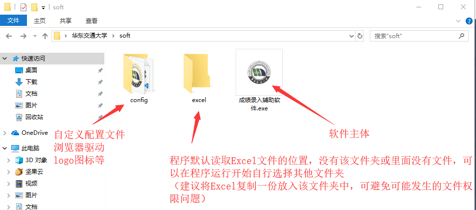
### 下载
[点击下载软件](https://github.com/EmeryWan/GradeEntry/releases)

## 使用方法
### 1. 配置
#### 查看本机chrome浏览器的版本
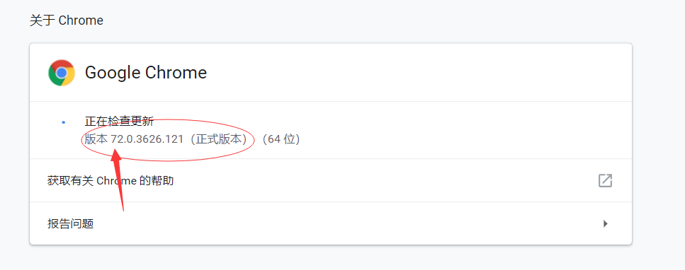
#### 查看对应的chromedriver版本

#### 下载地址
https://npm.taobao.org/mirrors/chromedriver  
https://blog.csdn.net/yoyocat915/article/details/80580066  
#### 如 该例为 v72 所以下载 V2.45 的chromedriver
|chromedriver版本 | 支持的Chrome版本|
|:--:|:--:|
|v2.46|v73-74|
|v2.45|v70-72|
|v2.44|v69-71|
|v2.43|v69-71|
|v2.42|v68-70|
|v2.41|v67-69|
|v2.40|v66-68|
|v2.39|v66-68|
|v2.38|v65-67|
|v2.37|v64-66|
|v2.36|v63-65|
|v2.35|v62-64|

#### V2.45的chromedriver
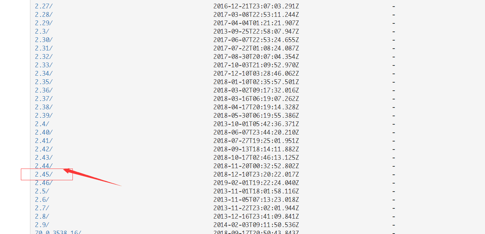
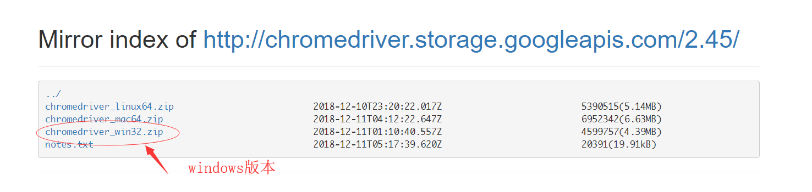
#### 放入config文件夹中
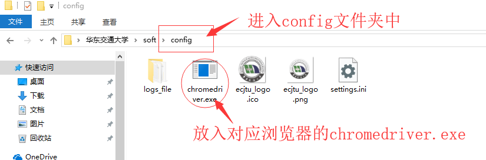

双击exe文件即可开始运行

### 2. 选择存储Excel的文件夹（在默认excel目录中放置了excel文件可跳过）
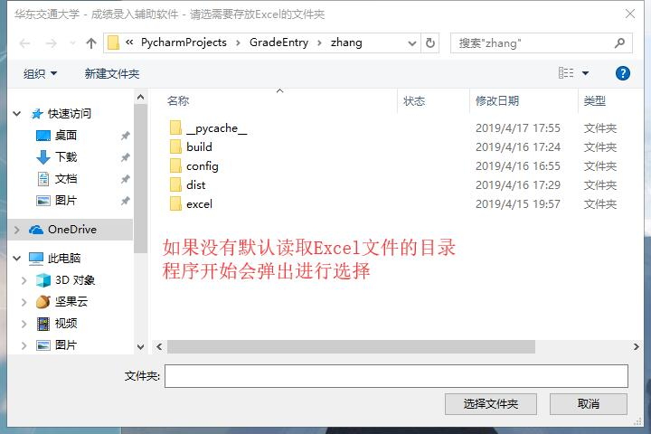

### 3. 默认打开浏览器和主程序窗体
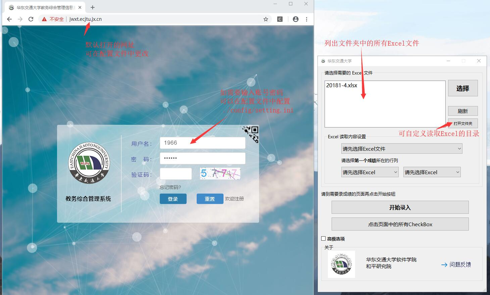
浏览器默认会打开的网址为：http://jwxt.ecjtu.jx.cn 华东交通大学教务总合管理的登录页面  
需要设置自动输入账号密码可以在配置文件中配置 (config/setting.ini)  
请继续进行登录操作

### 4. 进行自动录入操作

#### 请先进入需要录入成绩的页面，如图：
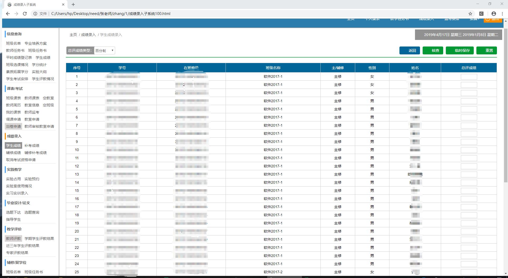

#### 在主窗体程序中进行相应的选择，读取excel文件
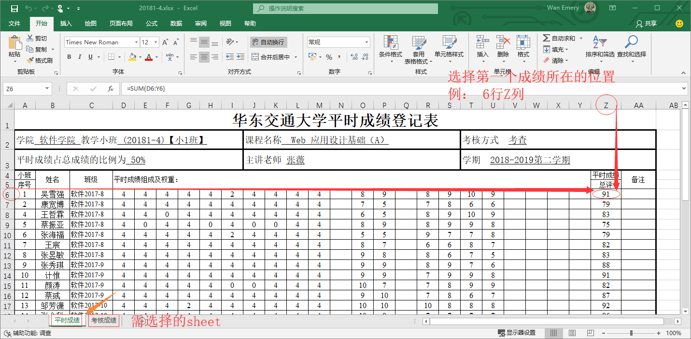  
##### 选取第一个学生成绩的位置
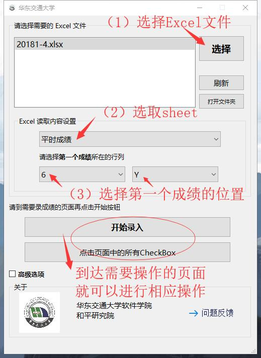 

#### 点击开始录入按钮
##### 在自动操作的过程中，软件会占用鼠标键盘，请尽量不要再操作鼠标键盘，避免一些成绩可能无法录入
请稍等几秒程序会将读取到的成绩信息录入到页面中需要填空的位置  

---
##### 选取错了需要录入成绩的位置？
重新选择Excel信息，再次进行一次输入即可，软件会自动覆盖原成绩
##### 录入了其他班的成绩？
重新选择Excel信息，再次进行一次输入即可，软件会自动覆盖原成绩
##### 页面中有保存的成绩？
软件在录入时会判断输入框上是否有成绩，如有，录入过程中会覆盖  

### 5.进行自动勾选
如果需要进行自动勾选checkbox， 请转到指定页面中，操作即可，如图：
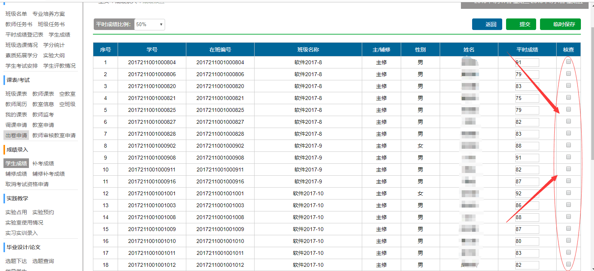  
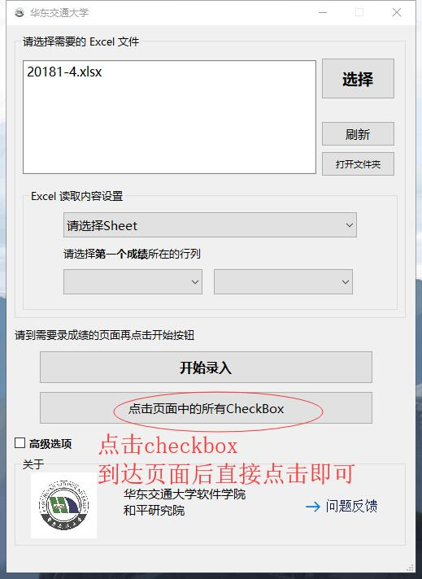 
